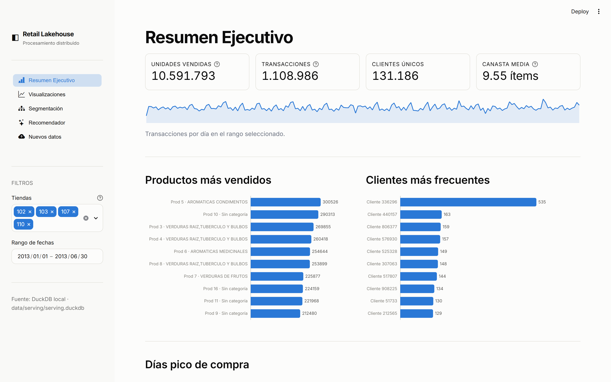
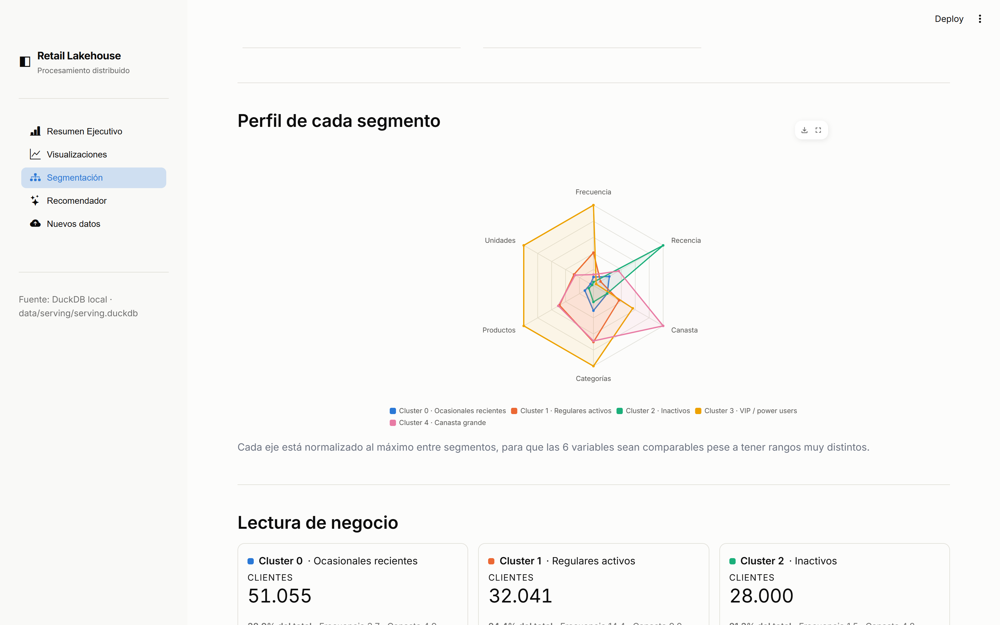
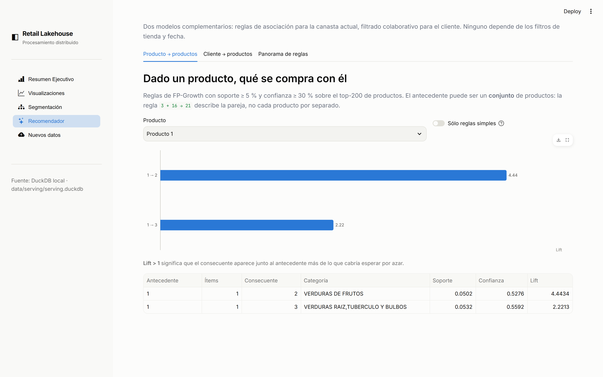

# Retail Transactions Lakehouse

[](https://github.com/criskian/retail-transactions-lakehouse/actions/workflows/ci.yml)
[](https://github.com/criskian/retail-transactions-lakehouse/actions/workflows/pipeline.yml)
[](pyproject.toml)
[](requirements-pipeline.txt)
[](LICENSE)

Lakehouse medallion sobre **1,1 millones de canastas** reales de supermercado:
ETL distribuido con PySpark, segmentación y recomendación con Spark MLlib, y un
dashboard analítico servido desde DuckDB.

**[→ Demo en vivo](https://retail-transactions-lakehouse.streamlit.app)**
· [Informe técnico](docs/informe_tecnico.md)
· [Arquitectura](docs/arquitectura.md)
· [Decisiones de diseño](docs/ADR/)

> La demo duerme tras 12 h sin visitas; el primer acceso la despierta en unos
> segundos.



<details>
<summary>Más capturas</summary>

**Segmentación** — búsqueda de k, proyección PCA como small multiples, perfiles en radar y lectura de negocio por segmento.



**Recomendador** — reglas de asociación y recomendaciones personalizadas.



</details>

---

## El problema

Un supermercado entrega seis meses de transacciones de cuatro tiendas. Cada fila
es una canasta: fecha, tienda, cliente y la lista de productos concatenada por
espacios. **No hay precios, ni identificador de transacción, ni cantidades.**

De ahí hay que sacar: qué se vende, cuándo, a quién, qué productos se compran
juntos y qué recomendarle a cada cliente. Y hay que hacerlo de forma que
incorporar un fichero nuevo regenere todos los resultados sin intervención.

## Lo que el dato obliga a decidir

| Restricción | Consecuencia de diseño |
|---|---|
| La canasta viene como una cadena de productos | El `explode` lleva la tabla de 1.108.987 filas a **10.591.792** |
| No hay id de transacción | Se construye como `sha2(fecha\|tienda\|cliente\|lista)`: determinista, así reprocesar no duplica |
| No hay cantidad | Si un producto aparece *N* veces en la canasta, son *N* unidades |
| Un producto mapea a varias categorías | Se resuelve a 1:1 con `min(category_id)`; sin eso el join infla todos los conteos |
| No hay precios | Toda métrica es **relativa**: volumen, frecuencia, diversidad, recencia |

## Arquitectura

```
  data/landing/*.csv                      GitHub Actions (JDK 17)
         │                          ┌──────────────────────────────┐
         ▼                          │  bronze  raw fiel a la fuente│
   ┌───────────┐                    │  silver  explode + catálogo  │
   │  Bronze   │  Parquet           │  gold    marts analíticos    │
   │  Silver   │  particionado      │  models  KMeans/FPGrowth/ALS │
   │  Gold     │  por store_id      │  export  serving.duckdb      │
   └───────────┘                    └──────────────┬───────────────┘
                                                   │ release asset
                                                   ▼
                                     ┌──────────────────────────────┐
                                     │  Streamlit + DuckDB          │
                                     │  24 MB · sin JVM · read-only│
                                     └──────────────────────────────┘
```

El **cómputo y el serving están separados a propósito**: la aplicación no
importa PySpark en ningún momento, sólo lee el artefacto que produce CI. Eso es
lo que la hace desplegable en una plataforma sin Java y con 1 GB de RAM.
Ver [ADR-0006](docs/ADR/0006-computo-y-serving-separados.md).

| Capa | Filas | Tamaño |
|---|---:|---:|
| Landing (6 CSV) | 1.108.987 canastas | 55 MB |
| Silver `transactions_items` | 10.591.792 | 379 MB |
| Gold (15 marts) | — | 9,5 MB |
| **Serving `serving.duckdb`** | — | **24 MB** |

## Resultados

**Segmentación (K-Means, k=5, silhouette 0,495 ± 0,008).** Seis variables de
comportamiento escaladas con z-score. El `k` se elige por silhouette
**promediado sobre 5 submuestras**: con una sola muestra el ganador oscilaba
entre 4 y 5, y bastaba un 0,45 % de datos nuevos para que cambiara. Las
submuestras se toman por hash del id, no con `DataFrame.sample`, que depende del
orden físico de las filas y por tanto no es reproducible al regenerar la capa
Gold — dos ejecuciones consecutivas dan ahora cifras idénticas. La proyección
PCA explica el **80,9 %** de la varianza en dos dimensiones.

| Segmento | % de clientes | Rasgo |
|---|---:|---|
| Ocasionales recientes | 39 % | Compran poco, estuvieron hace ~1 mes |
| Regulares activos | 24 % | ~14 compras, canasta media, recencia baja |
| Inactivos | 21 % | Compraron al inicio y no volvieron |
| VIP | 8 % | Alta frecuencia y diversidad; concentran el volumen |
| Canasta grande | 7 % | Esporádicos pero llenan el carro (~24 ítems) |

**Reglas de asociación (FP-Growth).** 270 reglas con soporte ≥ 5 % y confianza
≥ 30 %; 213 tienen antecedente de un solo producto. Las de mayor lift cruzan
verduras de raíz, verduras de fruto y aromáticas — canasta de mercado
tradicional. El antecedente se conserva como **conjunto**: una regla puede ser
`3 + 16 → 21`, y partirla en dos reglas simples falsearía la confianza
([ADR-0007](docs/ADR/0007-antecedentes-como-conjunto.md)).

**Recomendación (ALS implícito).** Top-10 por cliente para los 131.186 clientes.
La cantidad comprada se interpreta como confianza del interés, no como rating.

**Hallazgos de negocio.** Sábado y domingo concentran ~39 % más transacciones que
un miércoles. Sólo 449 de los 69.891 SKUs del catálogo se vendieron en seis
meses. El 46 % de los productos transaccionados no tiene categoría asignada:
un problema de calidad del catálogo, no del análisis.

## Cómo correrlo

**Requisitos:** Python 3.11, JDK 17 (PySpark 3.5 no soporta Java 21+), y en
Windows `winutils.exe` + `hadoop.dll`.

```bash
git clone https://github.com/criskian/retail-transactions-lakehouse
cd retail-transactions-lakehouse
git lfs pull                      # el dataset se versiona con Git LFS

pip install invoke
invoke install                    # crea .venv e instala dependencias
invoke winutils                   # sólo Windows
invoke doctor                     # verifica Java, Hadoop y los workers de Python

invoke pipeline                   # bronze -> silver -> gold -> models  (~8 min)
invoke export                     # construye data/serving/serving.duckdb
invoke app                        # http://localhost:8501
```

`make` sigue funcionando en Linux y macOS con los mismos objetivos. En Windows
usa `invoke`, que no depende de tener make instalado.

**Incorporar datos nuevos:**

```bash
cp nueva_tienda.csv data/landing/Transactions/115_Tran.csv
invoke ingest --check             # qué cambió
invoke ingest                     # reprocesa y republica si hay novedades
```

Hay un fichero de ejemplo en [`docs/demo_assets/`](docs/demo_assets/).

**Con Docker** (sólo la capa de serving, ~250 MB):

```bash
docker build -t retail-lakehouse .
docker run -p 8501:8501 retail-lakehouse
```

## Calidad

```bash
invoke test      # pytest: pipeline e2e sobre datos sintéticos + AppTest de las 5 páginas
invoke lint      # ruff check + format
```

La suite levanta un **lakehouse en miniatura** con datos sintéticos de la misma
forma que los reales, así que corre en CI sin necesitar el dataset ni Git LFS.

Después de cada corrida, `src/pipeline/quality.py` valida **26 contratos** sobre
la capa Gold —esquemas con pandera e invariantes entre tablas— y falla el build
si alguno se rompe. Ejemplos: que cada cliente segmentado exista en las
features, que los KPIs cuadren con los agregados diarios, y que ninguna regla de
asociación tenga el consecuente dentro de su propio antecedente.

## Estructura

```
src/pipeline/
  spark_session.py   Sanea el entorno antes de levantar el JVM (Java, workers, Hadoop native IO)
  bronze.py          CSV -> Parquet, sin lógica de negocio
  silver.py          explode + join con el catálogo + transaction_id
  gold.py            15 marts: negocio + serving
  models.py          K-Means + PCA, FP-Growth, ALS
  quality.py         Contratos de datos sobre Gold
  export_serving.py  Gold -> serving.duckdb
  ingest.py          Detección de cambios por sha256, lock y registro de corridas
  storage.py         Escritura atómica (evita dejar marts vacíos)
app/
  theme.py           Paleta validada y opciones base de ECharts
  data.py            Resolución de la fuente de datos; read-only
  views/             Una página por módulo
```

## Stack

**Procesamiento** PySpark 3.5 · Parquet · Spark MLlib
**Serving** DuckDB · Streamlit · Apache ECharts
**Calidad** pytest · pandera · ruff
**Operación** GitHub Actions · Docker · Git LFS

Cada elección está argumentada, con lo que se ganó y lo que se cedió, en
[`docs/ADR/`](docs/ADR/).

## Limitaciones conocidas

- **Sin split train/test.** Los modelos se validan con métricas internas
  (silhouette, soporte/confianza/lift) y cualitativamente. Un hold-out temporal
  con `precision@10` es el siguiente paso natural.
- **Cold start en ALS.** Los clientes ausentes del entrenamiento se descartan
  (`coldStartStrategy='drop'`). El fallback natural —recomendar el top del
  cluster K-Means del cliente— está diseñado pero no implementado.
- **FP-Growth limitado al top-200 de productos.** Con `minSupport=0.01` sobre
  los 449 productos el FP-tree agota la memoria en un nodo único.
- **Parquet sin formato transaccional.** No hay ACID ni time travel; se compensa
  con escrituras atómicas e ids deterministas. Delta Lake sería el siguiente
  paso ([ADR-0004](docs/ADR/0004-reprocesado-completo.md)).

## Sobre los datos

Dataset académico de transacciones de supermercado (curso de Procesamiento
Distribuido de Datos). Los identificadores de cliente ya vienen anonimizados en
el origen; no contiene nombres, direcciones ni medios de pago.

## Autores

Santiago Espinosa · Cristian Molina — Universidad, 2026.
Licencia [MIT](LICENSE).
